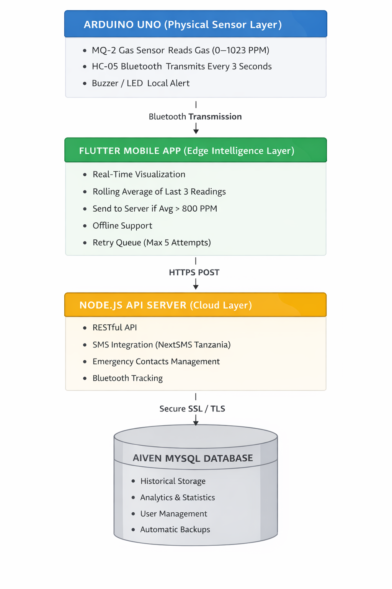
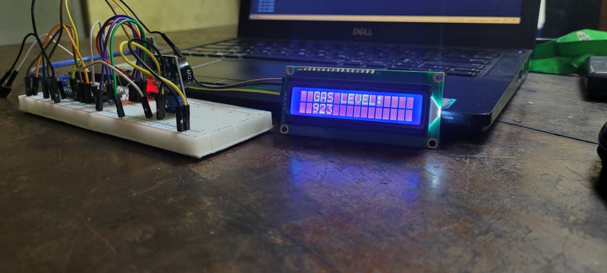

# 🔥 Gas Monitoring Arduino Based Project

An end-to-end IoT gas detection and monitoring system integrating **Arduino hardware**, **Flutter mobile intelligence**, and a **Node.js cloud backend** with SMS alerting for Tanzania.

This system provides **real-time gas detection**, **edge intelligence processing**, **cloud analytics**, and **automated emergency SMS alerts** — designed for homes, laboratories, and industrial environments.

<!-- Project Status -->


<!-- Deployment -->


<!-- Backend -->


<!-- Mobile -->


<!-- Hardware -->


<!-- Security -->


<!-- Messaging -->


<!-- License -->


<!-- Made With -->


---



---

## 🌐 Live Demo

**Web Dashboard:**  
https://ronaldgosso.github.io/gas-detector-api

View:
- Real-time gas levels
- Historical data analytics
- System status
- Emergency contacts

**API Documentation (Postman):**  
[Postman Link](https://documenter.getpostman.com/view/12814851/2sBXcHiJza)


---



---

# ✨ Key Features

## 📱 Mobile App (Flutter)
- Animated real-time charts
- Edge intelligence (avg > 800 PPM transmission logic)
- Offline resilience
- Exponential retry queue
- Tanzania optimized (+255 validation)
- Dark & Light themes

---

## 💻 Web Dashboard

- Live gas monitoring charts
- Daily & monthly analytics
- Emergency contact management
- Bluetooth status monitoring
- Export functionality (JSON, CSV, PDF)
- Fully responsive UI

---

## ⚙️ Backend API (Node.js)

- RESTful endpoints
- SMS alerts via NextSMS Tanzania
- 30-second SMS cooldown
- Secure Aiven MySQL cloud database
- SSL/TLS encrypted connections
- Bluetooth connection tracking

---

## 📡 Hardware Integration

- MQ-2 detects LPG, smoke, methane
- 0–1023 PPM sensitivity range
- HC-05 Bluetooth (10m range)
- Local buzzer & LED alerts
- Battery backup support

---

# 🛠️ Hardware Requirements

| Component | Specification | Qty |
|-----------|--------------|-----|
| Arduino UNO | ATmega328P | 1 |
| MQ-2 Gas Sensor | LPG/Smoke/Methane | 1 |
| HC-05 Bluetooth | Master/Slave | 1 |
| Active Buzzer | 5V | 1 | 
| Resistors | 220Ω, 1kΩ, 2kΩ | 4 | 
| Breadboard | Full-size | 1 | 
| Jumper Wires | Male/Female | 20 | 

---

# 🧠 Smart Logic Design

## Edge Intelligence

Instead of sending every sensor reading:

- Flutter calculates rolling average of last 3 values
- Only transmits if avg > 800 PPM
- Reduces server load
- Prevents SMS spam
- Saves bandwidth

## SMS Cooldown

Server enforces:
- 30-second delay between alert SMS
- Prevents flooding during sustained leaks

---

# 🔐 Security Architecture

- HTTPS encrypted API
- SSL/TLS secured database
- Cloud-hosted MySQL (Aiven)
- Environment variable configuration
- SMS validation (+255 Tanzania format)

---

# 🗄️ Tech Stack

### Hardware
- Arduino UNO
- MQ-2 Gas Sensor
- HC-05 Bluetooth

### Mobile
- Flutter
- Bluetooth LE
- Local persistence

### Backend
- Node.js
- Express.js
- MySQL
- CORS + Helmet security middleware

### Database
- Aiven MySQL (Cloud hosted)

### Hosting
- Vercel

### SMS
- NextSMS Tanzania API

---

# 🚀 API Overview

Core endpoints include:
```json
GET /api/health
GET /api/sensor/latest
GET /api/incidents
POST /api/incidents
GET /api/statistics
GET /api/chart/data
GET /api/settings
GET /emergency-contact/
POST /emergency-contact/
PUT /emergency-contact/settings/sms-selection
```


---

# 📈 Use Cases

- Residential gas monitoring
- Laboratory safety systems
- Restaurant kitchen monitoring
- Industrial leak detection
- School laboratory protection
- Smart home IoT projects

---

# 🔮 Future Improvements

- JWT authentication
- Role-based admin dashboard
- Push notifications (Firebase)
- Multi-sensor clustering
- AI-based leak prediction
- Dockerized deployment
- CI/CD automation

---

# 📌 Deployment

Backend hosted on:
https://gas-detector-api.vercel.app/

Database:
Aiven Cloud MySQL with automatic backups.

---


# 💻 Getting Started (Developer Setup)

To run this project locally for development:

1. **Clone the repository**
   ```bash
   git clone https://github.com/ronaldgosso/gas-detector-api.git
   cd gas-detector-api
   ```

2. **Install dependencies**
   
   If using the standard approach:
   ```bash
   npm install
   ```

   **Or, to install from the text file (`requirements.txt`):**

   *For Linux/macOS (Bash):*
   ```bash
   xargs -a requirements.txt npm install
   ```

   *For Windows (PowerShell):*
   ```powershell
   Get-Content requirements.txt | ForEach-Object { npm install $_ }
   ```

3. **Environment Setup**
   Create a `.env` file in the root directory and configure your necessary credentials (e.g., MySQL Database, NextSMS API, Port).

4. **Run the application**

   To start the API server in development mode (with auto-reload):
   ```bash
   npm run dev
   ```

   To start both the API server and Bluetooth receiver concurrently (useful when working with the Arduino hardware):
   ```bash
   npm run both
   ```

---

# 📜 License

MIT License

---

# 👨‍💻 Author

Developed as an IoT + Cloud integration project combining embedded systems, mobile intelligence, and cloud architecture.

✉️ ronaldgosso@gmail.com


---


